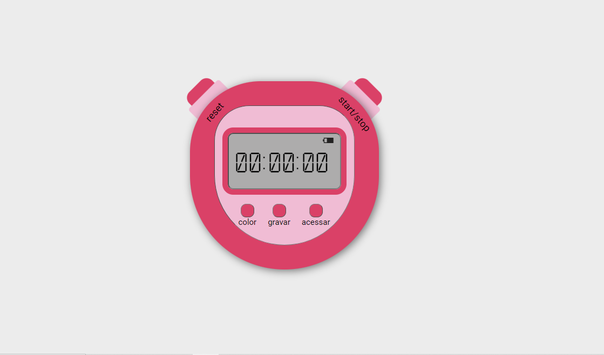

# Cronômetro Interativo

Um simples cronômetro desenvolvido em HTML, CSS e JavaScript. O cronômetro possui funcionalidades de iniciar, pausar, reiniciar, alternar cores e gravar marcos de tempo. Ideal para monitoramento de tempo em atividades esportivas, exercícios ou qualquer cenário que requer precisão temporal.

## Funcionalidades

- **Controle de Tempo:** Inicie, pause e reinicie o cronômetro.
- **Cores Personalizadas:** Altere dinamicamente as cores do cronômetro.
- **Gravação de Marcos:** Grave marcos de tempo durante a execução do cronômetro.

## Screenshot



## Como Usar

1. Clone o repositório:

    ```bash
    git clone https://github.com/isabellatressino/cronometro-javascript.git
    ```

2. Abra o arquivo `index.html` no navegador de sua preferência.

3. Explore as funcionalidades interativas do cronômetro.

**OU**

Acesse o [Cronômetro Interativo Online](link-do-site) para experimentar diretamente no seu navegador.

## Feito Com

- HTML
- CSS
- JavaScript

## O Que Aprendi

- A propriedade transform: rotate(45deg) em CSS;
- Alterar o elemento :root utilizando JS;
- Utilizar as funções setInterval() e clearInterval() em JS.
